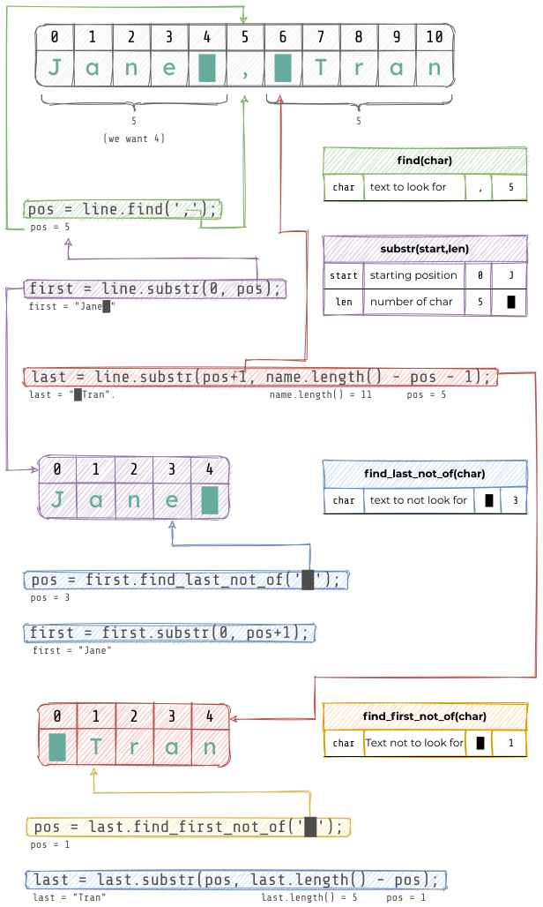

# 6.8 LAB: Warm up: Parsing strings

## Two Strings and A Comma
Prompt the user for a string that contains two strings separated by a comma.

### Acceptable Strings
```
Jill, Allen
Jill , Allen
Jill,Allen
```

### Example
```
Enter input string:
Jill, Allen
```

## Error If No Comma
Print an error message if the input string does not contain a comma.
Continue to prompt until a valid string is entered.

Note: If the input contains a comma,
then assume that the input also contains two strings.

### Example
```
Enter input string:
Jill Allen
Error: No comma in string.

Enter input string:
Jill, Allen
```

## Extract Two Words
Extract the two words from the input string and remove any spaces.
Store the strings in two separate variables and output the strings.

### Example
```
Enter input string:
Jill, Allen
First word: "Jill"
Second word: "Allen"
```

## Multiple lines of input
Using a loop, extend the program to handle multiple lines of input.
Continue until the user enters `q` to quit.

### Examples
```
Enter input string:
Jill, Allen
First word: "Jill"
Second word: "Allen"

Enter input string:
Golden , Monkey
First word: "Golden"
Second word: "Monkey"

Enter input string:
Washington,DC
First word: "Washington"
Second word: "DC"

Enter input string:
q
```

---
## String Parsing Functions


### Finding a character in a string
```cpp
size_t find(char c);
```
Function returns the _index_ position of the character in the string.
If not found, returns `string::npos`.

#### Example
```cpp
string s = "Trang Tran";
size_t pos = s.find('g');
cout << "char 'g' at pos " << pos << endl;
pos = s.find('j');
if (pos == string::npos) {
  cout << "char 'j' not found\n";
}
```

### Getting a substring
```cpp
string substr(size_t start, size_t len);
```
Returns a substring given a `start` and `len`.

#### Example
Continuing with the example above.
```cpp
size_t pos = s.find(' ');
if (pos != string::npos) {
  string first = s.substr(0, pos);
  cout << "first name: " << first << endl;
}
```

### Find first/last not of
```cpp
size_t pos find_first_not_of(char c);
size_t pos find_last_not_of(char c);
```
Find the first or last occurrence of anything that is not `c`.

#### Example
```cpp
        //  012345678901
string s = "****JANE****";
size_t beg = s.find_first_not_of('*');
size_t end = s.find_last_not_of('*');
// beg = 4, end = 7
// remember to +1
string name = s.substr(beg, end - beg + 1);
cout << "Name without *: " << name << endl;
```

---
## Trim Spaces
Make a copy of [ex-trim-asterisks.cpp] and create your file called
`ex-trim-spaces.cpp`.
Instead of trimming asterisks, trim spaces surrounding a word.

### Make a function
Make a function called `trim()` that takes in a `string` that may have
surrounding spaces and return a `string` without spaces.

#### Prototype
```
string trim(string s);
```

[ex-trim-asterisks.cpp]: ex-trim-asterisks.cpp