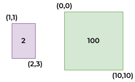

# 7.22 PRACTICE: Functions*: Rectangles sizes
Suppose a graphics program needs a function to indicate whether one
rectangle is smaller than another rectangle.
A rectangle is specified by its upper-left coordinate and bottom-right coordinate.
If the first rectangle is `(1,1)` and `(2,3)`,
and the second is `(0,0)` and `(10,10)`, the function returns `true`.

## Calculation
The are of the rectangle is calculated using `length * width`.
If you know the coordinates you can calculate the area.

The first rectangle is smaller than the second so your function will return `true`.

## Input
You will be given a file called `input.txt`.
The file contains a list of coordinates (8 numbers per line):
```
1 1 2 3 0 0 10 10
2 3 9 8 1 1 2 3
4 4 10 20 2 2 80 11
-1 -1 2 2 1 1 2 2
0 0 1 1 -1 -1 2 2
0 0 10 10 -12 -12 -1 -1
```

## Output
Your program should read in these numbers and output the following:
```
(1,1) (2,3) < (0,0) (10,10) is true
(2,3) (9,8) < (1,1) (2,3) is false
(4,4) (10,20) < (2,2) (80,11) is true
(-1,-1) (2,2) < (1,1) (2,2) is false
(0,0) (1,1) < (-1,-1) (2,2) is true
(0,0) (10,10) < (-12,-12) (-1,-1) is true
```

## Function Prototypes
```cpp
bool FirstRectangleSmaller(int,int,int,int,int,int,int,int);
void CompareRectangles(const string &);
```

## Hints
1. Work on the function first by using numeric constants because you
don't want to keep typing in a bunch of numbers over-and-over
`cout << FirstRectangleSmaller(1,1,2,3,0,0,10,10) << endl;`.
Check the last set of numbers.
2. Write the `CompareRectangles()` function to read in the file and output the lines.
Don't worry too much about the calculations yet, just read in the lines.
3. Change the output to match what is expected without the calculation.
Work on your formatting.
4. Incorporate your function in step #1 to finish up the program